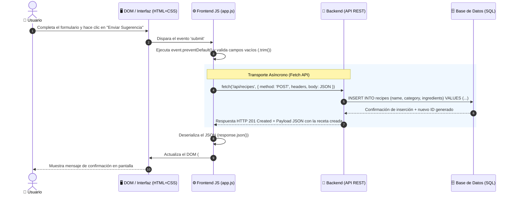

# 🍳 SaborDB — Recetario de Cocina

Frontend (HTML/CSS/JS) que muestra recetas, permite marcarlas como favoritas y recibe sugerencias mediante un formulario. Este documento define el diseño de la arquitectura backend y API REST que necesitará el proyecto.

## 📁 Estructura del proyecto

```
sabordb/
├── index.html
├── style.css
├── app.js
└── README.md
```

## 📋 Metadatos del proyecto

| Campo           | Valor                                       |
|-----------------|----------------------------------------------|
| Proyecto        | Recetario de Cocina (SaborDB)                |
| API utilizada   | TheMealDB API / API REST propia              |
| Tecnologías     | PHP, MySQL, Git, GitHub, JSON        |
| Materia         | INF240 - Programación Web                    |
| Plataforma      | Servidor Tecnoweb (Linux) / Localhost        |
| Estado          | ✔ Completado                                 |

## 1. Identifica tu recurso

El recurso principal del sistema es la **Receta**. Alrededor de él giran dos sub-recursos que dan soporte a la interactividad ya construida en el frontend:

- **Receta** — nombre, categoría, imagen, ingredientes y enlace a la fuente.
- **Favorito** — relación entre un usuario/sesión y una receta marcada mediante el botón "Me gusta".
- **Sugerencia** — receta propuesta por un usuario a través del formulario de sugerencias.

## 2. Diseña los endpoints (API REST)

Rutas CRUD para el recurso principal **Recetas**:

| Método | Ruta                  | Descripción                                |
|--------|-----------------------|----------------------------------------------|
| GET    | `/api/recetas`        | Lista todas las recetas guardadas             |
| GET    | `/api/recetas/{id}`   | Obtiene el detalle de una receta por su ID    |
| POST   | `/api/recetas`        | Crea una receta nueva                         |
| PUT    | `/api/recetas/{id}`   | Actualiza los datos de una receta existente   |
| DELETE | `/api/recetas/{id}`   | Elimina una receta por su ID                  |

Endpoints adicionales — Favoritos y Sugerencias:

| Método | Ruta                          | Descripción                                              |
|--------|-------------------------------|-------------------------------------------------------------|
| POST   | `/api/recetas/{id}/favorito`  | Alterna el estado de favorito de una receta                 |
| GET    | `/api/favoritos`              | Devuelve el total y el listado de recetas marcadas como favoritas |
| POST   | `/api/sugerencias`            | Recibe una sugerencia validada desde el formulario del sitio |

## 3. Bosqueja el JSON

**GET `/api/recetas`**
```json
{
  "status": "success",
  "data": [
    {
      "id": 52982,
      "nombre": "Spaghetti alla Carbonara",
      "categoria": "Italian",
      "imagen": "https://www.themealdb.com/images/media/meals/llcbn01574260722.jpg",
      "fuente_url": "https://www.themealdb.com/meal/52982",
      "ingredientes": ["Espagueti", "Huevo", "Panceta", "Queso parmesano"],
      "es_favorito": true
    },
    {
      "id": 52824,
      "nombre": "Beef Sunday Roast",
      "categoria": "Beef",
      "imagen": "https://www.themealdb.com/images/media/meals/ssrrrs1503664277.jpg",
      "fuente_url": "https://www.themealdb.com/meal/52824",
      "ingredientes": ["Carne de res", "Papas", "Zanahoria", "Romero"],
      "es_favorito": false
    }
  ],
  "total_favoritos": 1
}
```

**POST `/api/sugerencias`**
```json
{
  "status": "success",
  "message": "La receta \"Pizza Margarita\" ha sido enviada correctamente.",
  "data": {
    "id": 101,
    "nombre": "Pizza Margarita",
    "categoria": "Pasta",
    "ingredientes_clave": "Harina, tomate, queso",
    "estado": "pendiente_revision"
  }
}
```

## 4. Elige un lenguaje

**Lenguaje elegido:** PHP, con base de datos MySQL/MariaDB.

**Justificación técnica:**
- Curva de aprendizaje baja y sintaxis cercana a JavaScript, lo que facilita mantener consistencia con el frontend ya construido.
- Integración nativa con MySQL, ideal para modelar las tablas `recetas`, `favoritos` y `sugerencias` con relaciones simples.
- Amplia disponibilidad de hosting compartido económico (cPanel, servidores tipo Tecnoweb), útil para desplegar un proyecto académico sin infraestructura compleja.
- Frameworks ligeros (Slim) o PHP nativo permiten construir una API REST en JSON con pocos archivos.
- Amplia documentación y comunidad, lo que agiliza la resolución de dudas durante el desarrollo.

**Estructura sugerida del backend:**
```
backend/
├── config/
│   └── db.php              # Conexión PDO a MySQL
├── models/
│   ├── Receta.php
│   ├── Favorito.php
│   └── Sugerencia.php
├── api/
│   ├── recetas.php         # GET, POST, PUT, DELETE /api/recetas
│   ├── favoritos.php       # GET /api/favoritos, POST /api/recetas/{id}/favorito
│   └── sugerencias.php     # POST /api/sugerencias
└── .htaccess                # Reescritura de rutas amigables /api/...
```

**Esquema de base de datos (simplificado):**
```sql
CREATE TABLE recetas (
  id INT AUTO_INCREMENT PRIMARY KEY,
  nombre VARCHAR(150) NOT NULL,
  categoria VARCHAR(80),
  imagen VARCHAR(255),
  fuente_url VARCHAR(255),
  ingredientes TEXT
);

CREATE TABLE favoritos (
  id INT AUTO_INCREMENT PRIMARY KEY,
  receta_id INT NOT NULL,
  usuario_id VARCHAR(80) NOT NULL,
  FOREIGN KEY (receta_id) REFERENCES recetas(id)
);

CREATE TABLE sugerencias (
  id INT AUTO_INCREMENT PRIMARY KEY,
  nombre VARCHAR(150) NOT NULL,
  categoria VARCHAR(80) NOT NULL,
  ingredientes_clave TEXT NOT NULL,
  estado VARCHAR(30) DEFAULT 'pendiente_revision',
  creado_en DATETIME DEFAULT CURRENT_TIMESTAMP
);
```

## 5. Documenta y versiona

Estrategia de versionado con Git y GitHub:

```bash
# Inicializar repositorio (si aún no existe)
git init

# Agregar y confirmar los cambios
git add .
git commit -m "Diseño inicial del backend: recursos, endpoints y JSON de ejemplo"

# Renombrar la rama principal
git branch -M main

# Conectar con el repositorio remoto
git remote add origin <URL-del-repositorio>

# Subir los cambios
git push -u origin main
```

---
Fuente de datos de referencia: [TheMealDB](https://www.themealdb.com/)

---

## 📑 Práctica Semanal: Documentación de Arquitectura y Navegación del Sistema

> **Proyecto:** Recetario de Cocina (SaborDB)  
> **Entrega:** Unidad 1 - Diagramas de Arquitectura, Flujo de Datos y Endpoints CRUD
## 1. Diagrama Cliente - Servidor

Representación de la arquitectura física y lógica en tres capas del sistema para el recetario de cocina:

```mermaid
flowchart LR
    subgraph Cliente ["1. Capa Cliente (Frontend)"]
        direction TB
        Browser["Navegador Web"]
        UI["Interfaz Visual\n(HTML5 + CSS3)"]
        JS["Motor JavaScript\n(app.js - Fetch API)"]
        Browser --- UI
        UI <--> JS
    end

    subgraph Servidor ["2. Capa de Aplicación (Backend API)"]
        direction TB
        Server["Servidor HTTP / Router REST\n(Node.js / Express)"]
        Controller["Controlador de Recetas\n(Lógica de negocio y validaciones)"]
        Server <--> Controller
    end

    subgraph Persistencia ["3. Capa de Datos (Base de Datos)"]
        direction TB
        DB[(Motor RDBMS\nMySQL / PostgreSQL)]
        Tables[("Tablas:\n- recipes\n- categories")]
        DB --- Tables
    end

    %% Flujos de integración entre capas
    JS -->|"Petición HTTP asíncrona\n(GET, POST, PUT, DELETE) + JSON"| Server
    Server -->|"Respuesta HTTP (200, 201, 400, 404)\nCabeceras + Payload JSON"| JS

    Controller -->|"Consultas SQL parametrizadas\n(SELECT, INSERT, UPDATE, DELETE)"| DB
    DB -->|"Conjunto de registros / Resultados"| Controller
```



## 2. Flujo de Datos: Ciclo de Vida de una Petición

Trazabilidad completa del recorrido de la información en el sistema:  
**Acción del usuario $\rightarrow$ `fetch` $\rightarrow$ API REST $\rightarrow$ Respuesta JSON $\rightarrow$ Renderizado en Pantalla**.



## 3. Definición y Consolidación de Endpoints CRUD

* **Recurso Central:** `Recipe` (Receta culinaria)
* **Formato de Comunicación:** JSON (`Content-Type: application/json`)
* **Prefijo Base:** `/api/recipes`

---

### Matriz Consolidada de Rutas CRUD

| Operación CRUD | Método HTTP | Endpoint | Parámetros / Body de Entrada | Códigos de Estado | Descripción Funcional |
| :--- | :--- | :--- | :--- | :--- | :--- |
| **Read (Listar)** | `GET` | `/api/recipes` | Ninguno (Soporta query opcional: `?category=Pasta`) | `200 OK`<br>`500 Internal Error` | Retorna el catálogo completo de recetas registradas. |
| **Read (Detalle)** | `GET` | `/api/recipes/:id` | `:id` (Entero, parámetro de ruta) | `200 OK`<br>`404 Not Found` | Devuelve la información detallada e ingredientes de una receta específica. |
| **Create (Crear)** | `POST` | `/api/recipes` | **Body (JSON):**<br>`{ name, category, ingredients, instructions }` | `201 Created`<br>`400 Bad Request` | Registra una nueva receta enviada desde el formulario de sugerencias. |
| **Update (Modificar)**| `PUT` | `/api/recipes/:id` | `:id` (URL) +<br>**Body (JSON):** Campos actualizados | `200 OK`<br>`400 Bad Request`<br>`404 Not Found` | Actualiza la totalidad de los datos de una receta existente. |
| **Delete (Eliminar)** | `DELETE` | `/api/recipes/:id` | `:id` (Entero, parámetro de ruta) | `200 OK` (o `204`)<br>`404 Not Found` | Elimina una receta del sistema por su identificador. |

---

### Ejemplos de Cargas Útiles (Payloads) y Respuestas JSON

#### A. Consulta de Receta Individual (`GET /api/recipes/1`)
* **Código de respuesta:** `200 OK`
```json
{
  "status": "success",
  "data": {
    "id": 1,
    "name": "Spaghetti alla Carbonara",
    "category": "Italian",
    "ingredients": "Pasta, panceta, huevos, queso pecorino, pimienta negra",
    "instructions": "Hervir pasta al dente. Saltear panceta. Mezclar yemas con queso y ligar fuera del fuego.",
    "imageUrl": "https://www.themealdb.com/images/media/meals/llcbn01574260722.jpg",
    "isFavorite": false,
    "createdAt": "2026-09-12T10:00:00Z"
  }
}
```
#### B. Registro de Nueva Receta (POST /api/recipes)
* Carga útil enviada por el cliente (Request Body):
```json
{
  "name": "Pizza Margarita Tradicional",
  "category": "Italian",
  "ingredients": "Harina, levadura, salsa de tomate, mozzarella fresca, albahaca",
  "instructions": "Amasar, fermentar 24h, estirar y hornear a 250°C durante 8 minutos.",
  "imageUrl": "https://images.example.com/pizza.jpg"
}
```
* Respuesta emitida por el servidor (201 Created):
```json
{
  "status": "created",
  "message": "Receta registrada con éxito en el catálogo.",
  "data": {
    "id": 4,
    "name": "Pizza Margarita Tradicional",
    "category": "Italian",
    "ingredients": "Harina, levadura, salsa de tomate, mozzarella fresca, albahaca",
    "instructions": "Amasar, fermentar 24h, estirar y hornear a 250°C durante 8 minutos.",
    "imageUrl": "https://images.example.com/pizza.jpg",
    "isFavorite": false,
    "createdAt": "2026-09-12T22:30:00Z"
  }
}
```
#### C. Control de Validación de Campos Vacíos (POST /api/recipes)
* Respuesta emitida por el servidor (400 Bad Request):
```json
{
  "status": "error",
  "code": 400,
  "message": "Fallo de validación: los campos 'name', 'category' e 'ingredients' son obligatorios y no pueden estar vacíos."
}
```
